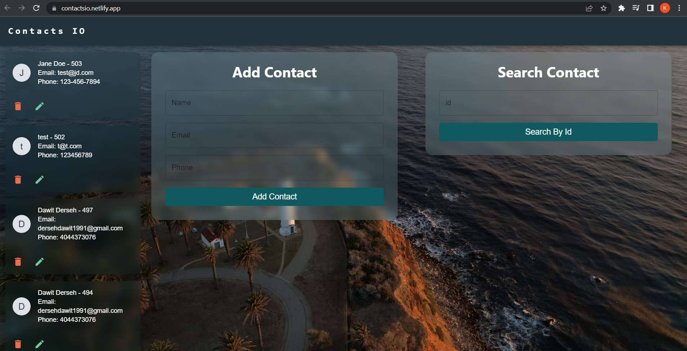

# Contacts IO

## App Information

### Title: Contacts IO

### Description:

Contacts IO is a simple react application using redux and axios as the main data flow. Contacts IO allows to visualize your contacts in a simple but elegant UI, as well for the complete CRUD Operations.

### How to Run

- Download the zip file
- Follow the instructions bellow

```NodeJS
cd <Location Folder>
npm install
npm start
```

- Fork the project
- Clone into your machine using the git commands

```NodeJS
git clone <GitHub ssh>
cd <Location Folder>
npm install
npm start
```

### Technologies and libraries used:

- React JS
- Formik
- Yup Schema Validation
- React Toastify
- Material UI

### Functionalities available:

- Get the list of Contacts
- Create a new contact
- Delete a contact
- Update a contact
- Get a contact by Id

Link to AWS Deployment: **[Contacts IO](https://contactsio.netlify.app/)**

### Future Adds

- Implement Backend
- Add sign up and sign in with authorization methods with JWTs
- Crate mobile version

### Site Look



### Author

Kevin Grimaldi.
